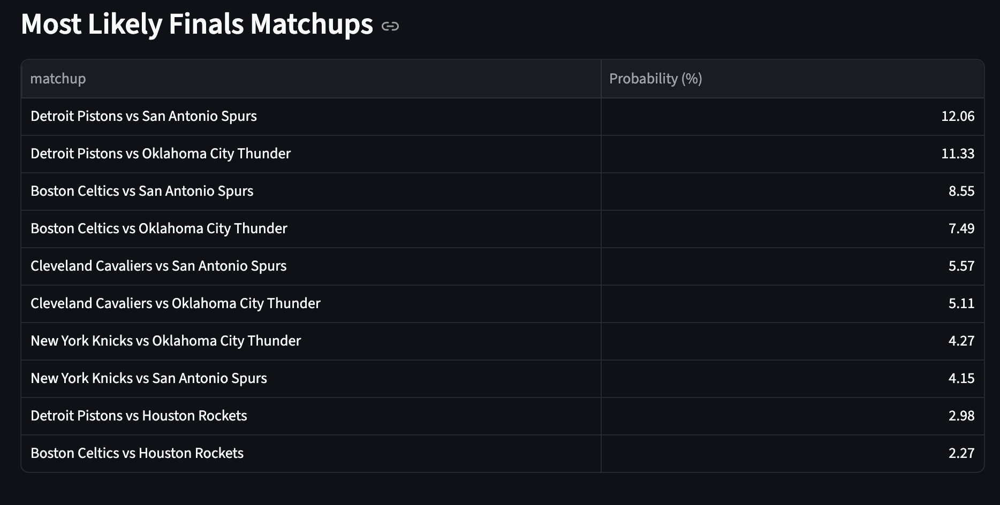

# NBA Finals Odds Engine (Elo + Monte Carlo + DuckDB)

Predict NBA playoff outcomes with a daily data pipeline that ingests BALLDONTLIE data, updates team Elo ratings, simulates the bracket 10,000 times, and serves results in a Streamlit dashboard.



## Repo Title + Description (for GitHub)

- **Suggested repo name:** `nba-finals-odds-engine`
- **Suggested description:** `Daily NBA playoff odds pipeline using BALLDONTLIE, DuckDB, Elo ratings, and Monte Carlo bracket simulation with a Streamlit dashboard.`

## What This Project Does

- Pulls NBA data from BALLDONTLIE (`games`, `standings`)
- Stores data in a 3-layer model:
  - `data/bronze`: raw JSON snapshots
  - `data/silver`: cleaned tables in DuckDB
  - `data/gold`: analytics outputs for dashboard/consumption
- Builds regular-season Elo from game results (configurable K-factor + home-court advantage)
- Builds playoff seeds 1-8 by conference (play-in ignored)
- Simulates best-of-7 playoffs game-by-game
- Runs Monte Carlo (default: 10,000 sims) to generate:
  - championship odds per team
  - conference win odds
  - top 10 Finals matchups

## Project Structure

```text
nba-playoff-odds/
  data/
    bronze/
    silver/
    gold/
    nba.duckdb
  docs/
    images/
      dashboard.png
  nba_playoff_odds/
  scripts/
    run_daily.py
    backfill_season.py
  tests/
  dashboard.py
  .env.example
  pyproject.toml
```

## Quick Start

### 1) Clone and install

```bash
git clone https://github.com/<your-username>/nba-finals-odds-engine.git
cd nba-finals-odds-engine
python3 -m pip install -e .[dev]
```

### 2) Configure environment

```bash
cp .env.example .env
```

Set your API key in `.env`:

```bash
BALLDONTLIE_API_KEY=your_key_here
```

Optional knobs:

```bash
ELO_K_FACTOR=20
ELO_HOME_COURT_ADV=65
MONTE_CARLO_SIMS=10000
BDL_MIN_REQUEST_INTERVAL_SECONDS=12.5
LOG_LEVEL=INFO
```

### 3) Run the pipeline

```bash
python3 scripts/run_daily.py --season 2025
```

### 4) Launch dashboard

```bash
streamlit run dashboard.py
```

## Scripts

- `scripts/run_daily.py`: full end-to-end run (ingestion -> silver -> Elo -> sims -> gold outputs)
- `scripts/backfill_season.py <season>`: backfill games + standings into bronze/silver for a season

Examples:

```bash
python3 scripts/backfill_season.py 2025
python3 scripts/run_daily.py --season 2025 --sims 10000 --k-factor 20 --home-adv 65 --seed 7
```

## Data Outputs

### DuckDB tables

- Bronze: `bronze_standings_raw`, `bronze_games_raw`
- Silver: `silver_standings`, `silver_games`
- Gold: `gold_championship_odds`, `gold_conference_odds`, `gold_finals_matchups`, `gold_runs`

### CSV outputs

- `data/gold/championship_odds.csv`
- `data/gold/conference_odds.csv`
- `data/gold/finals_matchups_top10.csv`
- `data/gold/last_updated.txt`

## Notes on BALLDONTLIE Tiers and Limits

- Some BALLDONTLIE keys/tier plans do not have access to standings.
- This project gracefully falls back to deriving standings from regular-season games if standings endpoint returns unauthorized.
- Free tier is heavily rate-limited; default request interval is set to avoid 429 responses.

## Testing

```bash
pytest
```

Current tests cover:

- Elo update math basics
- deterministic bracket simulation when RNG seed is fixed

## Common Issues

- `BALLDONTLIE_API_KEY is not set`
  - Confirm `.env` exists in repo root and variable name is exact.
- `Unauthorized`
  - API key may be invalid, or endpoint may be unavailable for your plan.
- `Too many requests`
  - Increase `BDL_MIN_REQUEST_INTERVAL_SECONDS` in `.env` (try `13` or `15`).
- DuckDB lock error while running scripts
  - Close DBeaver/other tools holding `data/nba.duckdb` write lock.

## License

MIT
